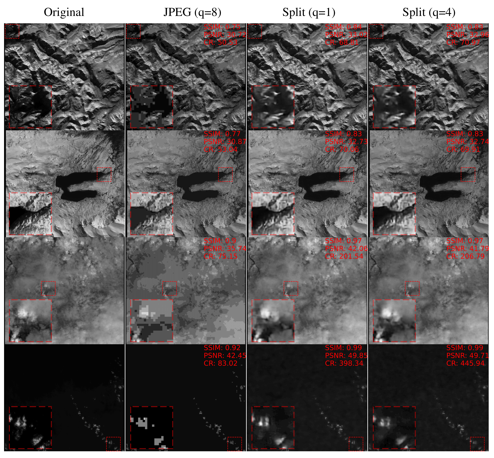

# LICOS
Learning Image Compression On board a Satellite constellation

<!-- TABLE OF CONTENTS -->
## Table of Contents

- [LICOS](#licos)
  - [Table of Contents](#table-of-contents)
  - [About the Project](#about-the-project)
  - [Getting Started](#getting-started)
    - [Prerequisites](#prerequisites)
    - [Set up datasets](#set-up-datasets)
    - [THRawS Dataset preparation](#thraws-dataset-preparation)
    - [Launch a training run](#launch-a-training-run)
    - [Evaluating a trained model](#evaluating-a-trained-model)
  - [Contact](#contact)

## About the Project

This is the code repository for the paper [Solving the Satellite Downlink Bottleneck: Distributed Onboard Learning of Image Compression](TODO). It provides the means to train and test an image compression model based on the Python module [CompressAI](https://interdigitalinc.github.io/CompressAI/) combined with the [PASEOS](https://www.github.com/aidotse/PASEOS) module to simulate physical constraints on the training. The paper demonstrates the onboard training of image compression for an Earth observation constellation on raw, unprocessed Sentinel-2 data but also works for postprocessed data such as the [AID dataset](https://captain-whu.github.io/AID/). To test on raw data, it uses the [THRawS dataset](https://zenodo.org/record/7908728) consisting of more than 100 samples (originally focusing on wildfires and volcanoes) from all over the world. We use [mpi4py](https://mpi4py.readthedocs.io/en/stable/) to distribute the training cross multiple devices / GPUs.


<p align="center">
  <a href="https://github.com/gomezzz/licos">
    
  </a>
</p>

## Getting Started

In the following we describe setting up the repo and launching a training run. For more details on the training process, please refer to the paper.

### Prerequisites

We recommend using [conda](https://docs.conda.io/en/latest/) to set-up your environment. This will also automatically set up CUDA and the cudatoolkit for you, enabling the use of GPUs for training, which is recommended.

First of all, clone the [GitHub](https://github.com/gomezzz/LICOS.git) repository as follows ([Git](https://git-scm.com/) required):

```
git clone https://github.com/gomezzz/LICOS.git
```

To install LICOS you can use [conda](https://docs.conda.io/en/latest/) as follows:

```
cd LICOS
conda env create -f environment.yml
```

This will create a new conda environment called `licos` and install the required software packages.
To activate the new environment, you can use:

```
conda activate licos
```

### Set up datasets

To launch the training on, e.g.,`AID`, it is necessary to download the corresponding datasets. Please, place the data in two folders `your_dataset/train` and `your_dataset/test` and create a config file in the `cfg` folder for your run. You need to specify the path to your dataset in the config file with the `dataset` parameter. Please, have a look at the `cfg/default_cfg.toml` file for an example and additional explanations on different parameters. By default, we rely on the dataloaders used by CompressAI. See [here](https://interdigitalinc.github.io/CompressAI/datasets.html) for more information.

If you want to use a custom dataset with non-RGB data, you may need to create a custom dataset class similar to the one in `raw_image_folder.py`.


### THRawS Dataset preparation
This work is based on Sentinel-2 Raw data. included in the dataset [THRawS](https://zenodo.org/record/7908728#.ZGxSMHZBy3A).
To prepare your data, proceed as follows. 

1. Navigate to the `data_preparation` directory and clone [PyRawS](https://github.com/ESA-PhiLab/PyRawS) in it with `git clone https://github.com/ESA-PhiLab/PyRawS.git` . PyRawS provide APIs to process Sentinel-2 raw data.
2. To install PyRaws, from the PyRawS directory run:
```conda env create -f environment.yml```.

3. Download [THRawS](https://zenodo.org/record/7908728#.ZGxSMHZBy3A). Please, notice the entire dataset size if of **147.6 GB**.
4. Place all the downaloded ZIP files into `data_preparation\data\THRAWS\raw`. There is an empty file called `put_THRAWS_here.txt` to give you indication of the right location. 
5. Decompress all the zip files in `data_preparation\data\THRAWS\raw`. 
6. Update the variables `PYRAWS_HOME_PATH` and `DATA_PATH` variables in `data_preparation\sys_cfg.py` with the absolute path to `PyRawS` and `data` directories. 
7. Move `data_preparation\sys_cfg.py` to `data_preparation\PyRawS\pyraws\sys_cfg.py`.
8. Activate the `pyraws` environment through:

```conda activate pyraws```

9. From `data_preparation` launch the `create_tif.py`. To this aim, you can use: 

```python create_tif.py --input_dir PATH_TO_RAW```

where `PATH_TO_RAW` is the path to the `data\THRAWS\raw` directory. 

10. `PyRawS` is not needed anymore and can be now removed.

### Launch a training run

To launch a training run, you can use the `main.py` script as follows:

```
mpiexec -n 4 python main.py --cfg cfg/default_cfg.toml
```

The parameter `--cfg` specifies the config file to use. The parameter `-n` specifies the number of processes to use. The number of processes should be equal to the number of satellites you want to simulate with PASEOS and matches the number of GPUs used, when GPUs are used. Details on the constellation and satellite parameters can be found in the file `licos/init_paseos.py`.

### Evaluating a trained model

You can evaluate a trained model by using the `eval_script.py` script. It may require adjustments as it is hard-coded to be used with the rawdata Sentinel-2 data. By default, it compares the compression to using JPEG.

## Contact

If you have any questions, feel to reach out to @gomezzz (email: `pablo.gomez at esa.int`) or @GabrieleMeoni (email: `G.Meoni@tudelft.nl`). You can also open an issue on the GitHub repository.

